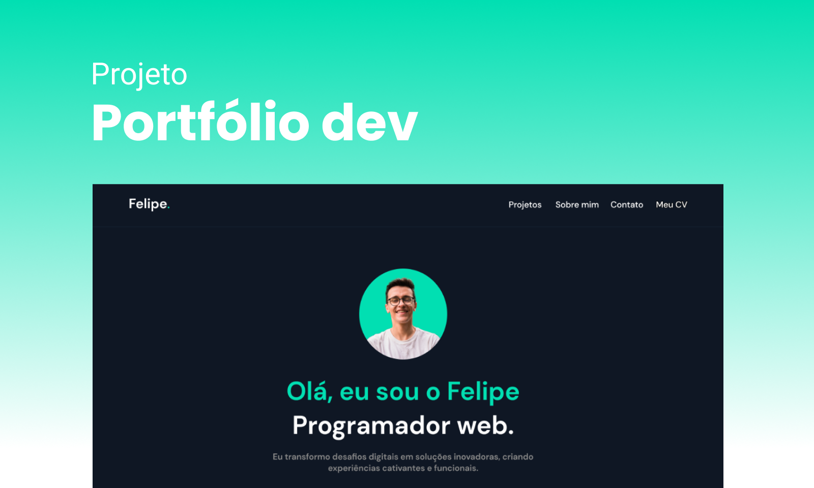

[Link do deploy](https://frases-note-react.vercel.app/)

## Objetivo

Este projeto tem como objetivo criar um portfólio online para apresentar de maneira organizada os meus projetos, informações sobre mim e formas de contato. A intenção é facilitar a visualização do meu trabalho para **clientes e empresas** que possam estar interessadas em me contratar.

## Tecnologias Utilizadas

- **React.js**: Para construção da interface do usuário de forma modular e eficiente.
- **Figma**: Para a criação do design e protótipo do site.

## Funcionalidades

- **Página Inicial**: Apresentação geral com uma breve descrição e navegação para outras seções.
- **Projetos**: Exibição dos meus principais projetos, com descrições detalhadas e links para repositórios e demos.
- **Sobre Mim**: Informações sobre minha formação, experiência e habilidades.
- **Contato**: Formulário para envio de mensagens e links para redes sociais.

## Quer saber mais sobre o meu trabalho? 

Acesse o meu portfólio online e confira todos os detalhes dos meus projetos, experiências e formas de entrar em contato comigo.

[Visite o Meu Portfólio Online](https://frases-note-react.vercel.app/)

---

Espero que o portfólio seja útil para conhecer mais sobre mim e o meu trabalho. Fique à vontade para entrar em contato para colaborações ou oportunidades de trabalho.

#